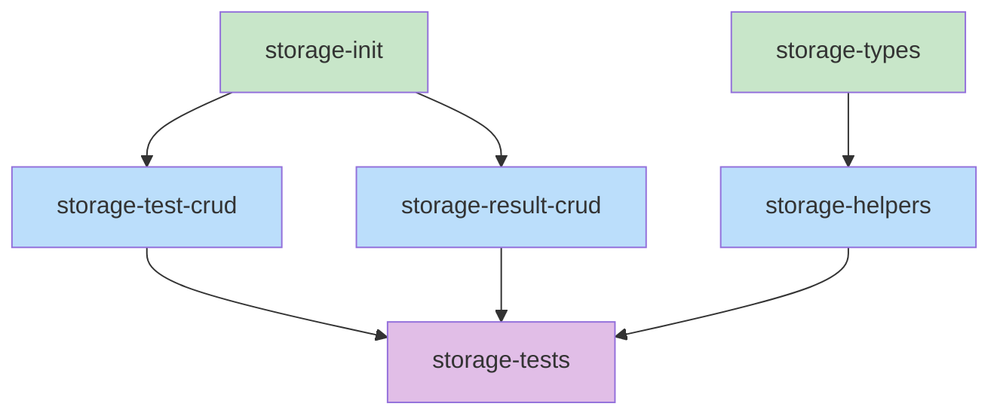

# Blueprint: Item 1 - Storage Layer

## 1. Structure Summary

### Files

- `src/storage.ts` — Main storage module exporting functions for test and result management
- `src/types.ts` — TypeScript type definitions (will be updated to include storage types)
- `.director/tests/` — Directory containing saved test definitions (JSON files)
- `.director/results/` — Directory containing run results (JSON files)
- `.director/config.json` — Optional config file for retention policy and other settings

### Type Definitions

```typescript
// Saved test structure
type SavedTest = {
  id: string;                    // slug-based ID (unique per project)
  name: string;                  // human-readable name
  test: TestDef;                 // the test definition
  createdAt: number;             // timestamp when created
  updatedAt: number;             // timestamp when last modified
};

// Test run result
type TestRun = {
  runId: string;                 // unique ID per run (uuid or timestamp-based)
  testId: string;                // which test was run
  timestamp: number;             // when the run happened
  result: TestResult;            // the test result
  nestedVersions?: Record<string, number>; // map of nested testId -> their updatedAt timestamp at run time
};

// Director config
type DirectorConfig = {
  resultRetention: number;       // how many results to keep per test (default: 50)
  version: string;               // config version for future migrations
};

// Internal error types
type StorageError = {
  code: 'SLUG_COLLISION' | 'NOT_FOUND' | 'INVALID_INPUT' | 'IO_ERROR';
  message: string;
};
```

### Component Interactions

- **MCP Server** calls storage functions to CRUD tests and results
- **API Server** calls storage functions for HTTP endpoints
- **Test Runner** queries storage to load tests by ID before execution
- **Storage module** reads/writes `.director/` directory structure
- **Staleness detection** compares nested test `updatedAt` timestamps with run `nestedVersions`

### Directory Structure

```
project-root/
  .director/
    config.json                  # retention policy, version
    tests/
      login-flow.json            # SavedTest, ID = "login-flow" (auto-slugified)
      packaging-flow.json
      e2e-full.json
    results/
      login-flow/
        result-20260207T091500.json  # TestRun with runId = "20260207T091500"
        result-20260206T140200.json
        ... (up to 50 kept)
      packaging-flow/
        result-20260207T160000.json
        ... (up to 50 kept)
```

---

## 2. Function Blueprints

### `async function initStorage(projectRoot: string): Promise<void>`

**Signature:**
```typescript
export async function initStorage(projectRoot: string): Promise<void>
```

**Pseudocode:**
1. Verify `projectRoot` is a valid directory
2. Check if `.director/` exists
3. If not, create `.director/`, `.director/tests/`, `.director/results/`
4. Check if `.director/config.json` exists
5. If not, create with default config (resultRetention: 50)
6. Verify all directories are readable/writable

**Error Handling:**
- `INVALID_INPUT`: projectRoot doesn't exist or isn't a directory
- `IO_ERROR`: Can't create directories or write config
- Re-throw if chmod/permission issues

**Edge Cases:**
- `.director/` exists but is a file, not directory
- `.director/config.json` exists but is corrupted JSON
- Partial `.director/` structure exists (some dirs missing)

**Test Strategy:**
- Test with nonexistent project root
- Test with existing `.director/`
- Test with missing subdirectories
- Test with corrupted config.json

**Stub:**
```typescript
export async function initStorage(projectRoot: string): Promise<void> {
  // TODO: Step 1 - Validate projectRoot
  // TODO: Step 2 - Check .director/ exists
  // TODO: Step 3 - Create .director/ and subdirs if missing
  // TODO: Step 4 - Validate/create config.json
  // TODO: Step 5 - Verify permissions
  throw new Error('Not implemented');
}
```

---

### `async function saveTest(projectRoot: string, name: string, testDef: TestDef): Promise<SavedTest>`

**Signature:**
```typescript
export async function saveTest(
  projectRoot: string,
  name: string,
  testDef: TestDef
): Promise<SavedTest>
```

**Pseudocode:**
1. Slugify `name` to create ID (lowercase, alphanumeric + dashes)
2. Check if `.director/tests/{id}.json` already exists
3. If collision, throw SLUG_COLLISION error
4. Create SavedTest object with `id`, `name`, `test`, `createdAt`, `updatedAt`
5. Write to `.director/tests/{id}.json` atomically
6. Return SavedTest

**Error Handling:**
- `SLUG_COLLISION`: ID already exists
- `INVALID_INPUT`: name is empty or testDef is invalid
- `IO_ERROR`: Can't write file

**Edge Cases:**
- `name` with special chars, spaces, unicode
- `name` that slugifies to empty string
- Concurrent saves with same slug (race condition)

**Test Strategy:**
- Test with valid name and test definition
- Test with duplicate name (should collision)
- Test with special characters
- Test with empty name

**Stub:**
```typescript
export async function saveTest(
  projectRoot: string,
  name: string,
  testDef: TestDef
): Promise<SavedTest> {
  // TODO: Step 1 - Validate inputs
  // TODO: Step 2 - Slugify name
  // TODO: Step 3 - Check for collision
  // TODO: Step 4 - Create SavedTest object
  // TODO: Step 5 - Write atomically to file
  // TODO: Step 6 - Return SavedTest
  throw new Error('Not implemented');
}
```

---

### `async function getTest(projectRoot: string, id: string): Promise<SavedTest>`

**Signature:**
```typescript
export async function getTest(projectRoot: string, id: string): Promise<SavedTest>
```

**Pseudocode:**
1. Validate `id` format (alphanumeric + dashes)
2. Check if `.director/tests/{id}.json` exists
3. If not, throw NOT_FOUND
4. Read file, parse JSON
5. Validate against SavedTest type
6. Return SavedTest

**Error Handling:**
- `NOT_FOUND`: File doesn't exist
- `IO_ERROR`: Can't read file
- Throw if JSON is corrupted (should not happen in normal use)

**Edge Cases:**
- `id` with invalid characters
- `.director/tests/{id}.json` exists but is corrupted JSON
- File is being written concurrently (race)

**Test Strategy:**
- Test with existing ID
- Test with nonexistent ID
- Test with invalid ID format

**Stub:**
```typescript
export async function getTest(projectRoot: string, id: string): Promise<SavedTest> {
  // TODO: Step 1 - Validate id format
  // TODO: Step 2 - Check file exists
  // TODO: Step 3 - Read file
  // TODO: Step 4 - Parse JSON
  // TODO: Step 5 - Validate structure
  // TODO: Step 6 - Return SavedTest
  throw new Error('Not implemented');
}
```

---

### `async function listTests(projectRoot: string): Promise<SavedTest[]>`

**Signature:**
```typescript
export async function listTests(projectRoot: string): Promise<SavedTest[]>
```

**Pseudocode:**
1. Check if `.director/tests/` exists
2. List all `.json` files in directory
3. For each file, read and parse as SavedTest
4. Filter out invalid entries (log warnings)
5. Sort by `updatedAt` descending (newest first)
6. Return array

**Error Handling:**
- `IO_ERROR`: Can't read directory or files
- Skip corrupted files with warning (don't fail entire list)

**Edge Cases:**
- `.director/tests/` is empty
- Some files are corrupted JSON
- Some files are not .json
- Permissions prevent reading some files

**Test Strategy:**
- Test with empty directory
- Test with multiple tests
- Test with corrupted JSON file
- Test with non-.json files

**Stub:**
```typescript
export async function listTests(projectRoot: string): Promise<SavedTest[]> {
  // TODO: Step 1 - Check directory exists
  // TODO: Step 2 - List all .json files
  // TODO: Step 3 - Read and parse each file
  // TODO: Step 4 - Filter invalid entries
  // TODO: Step 5 - Sort by updatedAt
  // TODO: Step 6 - Return array
  throw new Error('Not implemented');
}
```

---

### `async function deleteTest(projectRoot: string, id: string): Promise<void>`

**Signature:**
```typescript
export async function deleteTest(projectRoot: string, id: string): Promise<void>
```

**Pseudocode:**
1. Validate `id` format
2. Delete `.director/tests/{id}.json`
3. Delete entire `.director/results/{id}/` directory (all results for this test)
4. Return

**Error Handling:**
- `NOT_FOUND`: Test file doesn't exist
- `IO_ERROR`: Can't delete files or directories

**Edge Cases:**
- Test file doesn't exist (should be NOT_FOUND)
- Results directory doesn't exist (OK, skip)
- Partial deletion (test file deleted, results dir remains)

**Test Strategy:**
- Test delete of existing test
- Test delete of nonexistent test
- Verify test file and results directory both removed

**Stub:**
```typescript
export async function deleteTest(projectRoot: string, id: string): Promise<void> {
  // TODO: Step 1 - Validate id
  // TODO: Step 2 - Check test exists
  // TODO: Step 3 - Delete test file
  // TODO: Step 4 - Delete results directory
  // TODO: Step 5 - Return
  throw new Error('Not implemented');
}
```

---

### `async function saveResult(projectRoot: string, testId: string, result: TestResult, nestedVersions?: Record<string, number>): Promise<TestRun>`

**Signature:**
```typescript
export async function saveResult(
  projectRoot: string,
  testId: string,
  result: TestResult,
  nestedVersions?: Record<string, number>
): Promise<TestRun>
```

**Pseudocode:**
1. Generate unique `runId` (ISO timestamp or UUID)
2. Create TestRun object with runId, testId, timestamp, result, nestedVersions
3. Ensure `.director/results/{testId}/` directory exists
4. Write to `.director/results/{testId}/result-{runId}.json`
5. Enforce retention policy: if > max results for this test, delete oldest
6. Update parent test's `updatedAt` timestamp
7. Return TestRun

**Error Handling:**
- `NOT_FOUND`: Test doesn't exist (optional: auto-create directory)
- `IO_ERROR`: Can't write file

**Edge Cases:**
- Test directory doesn't exist yet (create it)
- Concurrent saves with same test (race, but unique runIds prevent collision)
- Retention policy triggers and deletes old results

**Test Strategy:**
- Test save result for existing test
- Test save result for nonexistent test
- Test retention policy (save 51 results, verify only 50 kept)
- Verify nestedVersions is stored

**Stub:**
```typescript
export async function saveResult(
  projectRoot: string,
  testId: string,
  result: TestResult,
  nestedVersions?: Record<string, number>
): Promise<TestRun> {
  // TODO: Step 1 - Validate inputs
  // TODO: Step 2 - Generate runId
  // TODO: Step 3 - Create TestRun object
  // TODO: Step 4 - Ensure test directory exists
  // TODO: Step 5 - Write result file
  // TODO: Step 6 - Enforce retention policy
  // TODO: Step 7 - Update test updatedAt
  // TODO: Step 8 - Return TestRun
  throw new Error('Not implemented');
}
```

---

### `async function listResults(projectRoot: string, testId: string): Promise<TestRun[]>`

**Signature:**
```typescript
export async function listResults(projectRoot: string, testId: string): Promise<TestRun[]>
```

**Pseudocode:**
1. Check if `.director/results/{testId}/` exists
2. List all `result-*.json` files in directory
3. For each file, read and parse as TestRun
4. Sort by `timestamp` descending (newest first)
5. Return array

**Error Handling:**
- `NOT_FOUND`: Results directory doesn't exist (return empty array)
- `IO_ERROR`: Can't read directory or files

**Edge Cases:**
- No results yet (empty array)
- Corrupted result files (skip with warning)
- Non-result files in directory (skip)

**Test Strategy:**
- Test with no results
- Test with multiple results (verify sorted by timestamp)
- Test with corrupted result file

**Stub:**
```typescript
export async function listResults(projectRoot: string, testId: string): Promise<TestRun[]> {
  // TODO: Step 1 - Check directory exists
  // TODO: Step 2 - List all result-*.json files
  // TODO: Step 3 - Read and parse each file
  // TODO: Step 4 - Sort by timestamp descending
  // TODO: Step 5 - Return array
  throw new Error('Not implemented');
}
```

---

### `async function getResult(projectRoot: string, testId: string, runId: string): Promise<TestRun>`

**Signature:**
```typescript
export async function getResult(
  projectRoot: string,
  testId: string,
  runId: string
): Promise<TestRun>
```

**Pseudocode:**
1. Validate `testId` and `runId` format
2. Check if `.director/results/{testId}/result-{runId}.json` exists
3. If not, throw NOT_FOUND
4. Read file, parse JSON as TestRun
5. Return TestRun

**Error Handling:**
- `NOT_FOUND`: File doesn't exist
- `IO_ERROR`: Can't read file

**Edge Cases:**
- `runId` with invalid format
- File is corrupted JSON

**Test Strategy:**
- Test get existing result
- Test get nonexistent result
- Test with invalid runId format

**Stub:**
```typescript
export async function getResult(
  projectRoot: string,
  testId: string,
  runId: string
): Promise<TestRun> {
  // TODO: Step 1 - Validate inputs
  // TODO: Step 2 - Check file exists
  // TODO: Step 3 - Read file
  // TODO: Step 4 - Parse JSON
  // TODO: Step 5 - Return TestRun
  throw new Error('Not implemented');
}
```

---

### Helper: `function slugify(name: string): string`

**Signature:**
```typescript
function slugify(name: string): string
```

**Pseudocode:**
1. Trim whitespace
2. Convert to lowercase
3. Replace spaces and special chars with dashes
4. Remove consecutive dashes
5. Remove leading/trailing dashes
6. Return slug

**Error Handling:**
- If result is empty string, throw INVALID_INPUT

**Edge Cases:**
- Name with only special characters
- Name with unicode (convert or strip?)
- Name with trailing spaces

**Test Strategy:**
- Test normal name
- Test name with spaces
- Test name with special chars
- Test name with unicode

**Stub:**
```typescript
function slugify(name: string): string {
  // TODO: Step 1 - Trim and lowercase
  // TODO: Step 2 - Replace spaces/special chars with dashes
  // TODO: Step 3 - Clean up consecutive/leading/trailing dashes
  // TODO: Step 4 - Validate not empty
  // TODO: Step 5 - Return slug
  throw new Error('Not implemented');
}
```

---

### Helper: `async function enforceRetention(projectRoot: string, testId: string, maxResults: number): Promise<void>`

**Signature:**
```typescript
async function enforceRetention(projectRoot: string, testId: string, maxResults: number): Promise<void>
```

**Pseudocode:**
1. List all results for testId
2. Sort by timestamp
3. If count > maxResults, delete oldest (count - maxResults) entries
4. Return

**Error Handling:**
- `IO_ERROR`: Can't delete files

**Edge Cases:**
- No results to delete
- maxResults is 0 (delete all)

**Stub:**
```typescript
async function enforceRetention(projectRoot: string, testId: string, maxResults: number): Promise<void> {
  // TODO: Step 1 - List all results
  // TODO: Step 2 - Sort by timestamp
  // TODO: Step 3 - Delete oldest if needed
  // TODO: Step 4 - Return
  throw new Error('Not implemented');
}
```

---

## 3. Task Dependency Graph

### YAML Graph

```yaml
tasks:
  - id: storage-types
    files: [src/types.ts]
    tests: []
    description: Define SavedTest, TestRun, DirectorConfig, and helper types
    parallel: true
    depends-on: []

  - id: storage-init
    files: [src/storage.ts]
    tests: [src/storage.test.ts]
    description: Implement initStorage() function with directory creation
    parallel: true
    depends-on: []

  - id: storage-test-crud
    files: [src/storage.ts]
    tests: [src/storage.test.ts]
    description: Implement saveTest, getTest, listTests, deleteTest functions
    parallel: false
    depends-on: [storage-init]

  - id: storage-result-crud
    files: [src/storage.ts]
    tests: [src/storage.test.ts]
    description: Implement saveResult, listResults, getResult functions with retention
    parallel: false
    depends-on: [storage-init]

  - id: storage-helpers
    files: [src/storage.ts]
    tests: [src/storage.test.ts]
    description: Implement slugify and enforceRetention helper functions
    parallel: false
    depends-on: [storage-types]

  - id: storage-tests
    files: [src/storage.test.ts]
    tests: [src/storage.test.ts]
    description: Write comprehensive unit tests for all storage functions
    parallel: false
    depends-on: [storage-test-crud, storage-result-crud, storage-helpers]
```

### Execution Waves

**Wave 1 (no dependencies):**
- storage-types
- storage-init

**Wave 2 (depends on Wave 1):**
- storage-test-crud
- storage-result-crud
- storage-helpers

**Wave 3 (depends on Wave 2):**
- storage-tests

### Mermaid Visualization



### Summary
- **Total tasks:** 6
- **Total waves:** 3
- **Max parallelism:** 2 (Wave 1)
- **Critical path:** storage-init → storage-test-crud/result-crud → storage-tests

---

## Implementation Notes

- **File I/O:** Use Node.js `fs/promises` for async file operations
- **JSON validation:** Use Zod schemas to validate loaded JSON matches expected types
- **Atomic writes:** Use temporary file + rename pattern to avoid corruption on crash
- **Timestamps:** Use `Date.now()` for all timestamps (milliseconds since epoch)
- **IDs:** Use ISO 8601 timestamps as runIds (e.g., "20260207T091530Z")
- **Slugs:** Keep slugs lowercase alphanumeric + dashes, max 64 chars
- **Error messages:** Include file paths and operation type for debugging