# Consolidated Task Graph

This document was auto-generated from blueprint documents.

## Summary

- **Total tasks:** 46
- **Total waves:** 5
- **Max parallelism:** 16

## Execution Waves

**Wave 1:** run-test-type, mcp-crud-tools, mcp-result-tools, gui-run-button, gui-log-entry, gui-run-store-impl, event-types, gui-utils, gui-result-step-card, gui-step-card, gui-test-list, api-server-setup, storage-types, storage-init, gui-scaffold, gui-types
**Wave 2:** run-test-handler, mcp-run-test-extend, gui-log-panel, event-runner, event-cdp, gui-results-tab, gui-history-item, gui-nested-block, api-crud-routes, api-chrome-status, api-cli, storage-test-crud, storage-result-crud, storage-helpers, gui-api-client, gui-ws-client
**Wave 3:** run-test-tests, mcp-tests, gui-wire-run-ui, event-tests, gui-history-tab, gui-steps-tab, api-run-route, storage-tests, gui-stores
**Wave 4:** gui-wire-tabs, gui-test-detail, api-tests, gui-layout
**Wave 5:** gui-app

## Task Graph (YAML)

```yaml
tasks:
  - id: run-test-type
    files: [src/types.ts]
    tests: []
    description: Add { run_test: string } variant to StepDef union type
    parallel: true
    depends-on: []
  - id: run-test-handler
    files: [src/step-runner.ts]
    tests: [src/step-runner.test.ts]
    description: Implement runTestStep() handler with cycle detection, update executeStep() dispatch, thread projectRoot and RunContext through runner functions
    parallel: false
    depends-on: [run-test-type]
  - id: run-test-tests
    files: [src/step-runner.test.ts]
    tests: [src/step-runner.test.ts]
    description: Unit tests for run_test nesting, cycle detection, vars flow, error handling
    parallel: false
    depends-on: [run-test-handler]
  - id: mcp-crud-tools
    files: [src/server.ts]
    tests: [src/server.test.ts]
    description: Add save_test, list_tests, get_test, delete_test tools to MCP server, register in tools/list handler
    parallel: true
    depends-on: []
  - id: mcp-result-tools
    files: [src/server.ts]
    tests: [src/server.test.ts]
    description: Add list_results, get_result tools to MCP server
    parallel: true
    depends-on: []
  - id: mcp-run-test-extend
    files: [src/server.ts]
    tests: [src/server.test.ts]
    description: Extend run_test with optional testId for saved test execution and result persistence
    parallel: false
    depends-on: [mcp-crud-tools]
  - id: mcp-tests
    files: [src/server.test.ts]
    tests: [src/server.test.ts]
    description: Unit tests for all MCP tools including CRUD, result queries, and testId-based runs
    parallel: false
    depends-on: [mcp-crud-tools, mcp-result-tools, mcp-run-test-extend]
  - id: gui-run-button
    files: [gui/src/features/runs/RunButton.tsx]
    tests: []
    description: Create RunButton component with 4 states (idle, running, busy, chrome-offline)
    parallel: true
    depends-on: []
  - id: gui-log-entry
    files: [gui/src/features/runs/LogEntry.tsx]
    tests: []
    description: Create LogEntry component with console/network/step display formatting
    parallel: true
    depends-on: []
  - id: gui-log-panel
    files: [gui/src/features/runs/LogPanel.tsx]
    tests: []
    description: Create LogPanel with collapsible layout, auto-scroll, auto-expand on run start
    parallel: false
    depends-on: [gui-log-entry]
  - id: gui-run-store-impl
    files: [gui/src/stores/run-store.ts]
    tests: []
    description: Implement handleWsMessage with step status tracking and log accumulation
    parallel: true
    depends-on: []
  - id: gui-wire-run-ui
    files: [gui/src/features/tests/TestDetail.tsx, gui/src/features/tests/StepsTab.tsx]
    tests: []
    description: Wire RunButton into TestDetail header, LogPanel below tabs, pass stepStatuses to StepCard
    parallel: false
    depends-on: [gui-run-button, gui-log-panel, gui-run-store-impl]
  - id: event-types
    files: [src/types.ts]
    tests: []
    description: Define RunEvent union type and OnEvent callback type
    parallel: true
    depends-on: []
  - id: event-runner
    files: [src/step-runner.ts]
    tests: [src/step-runner.test.ts]
    description: Add onEvent parameter to runTest/runSteps, emit step:start/pass/fail events in step loops, thread through nested execution
    parallel: false
    depends-on: [event-types]
  - id: event-cdp
    files: [src/cdp-client.ts]
    tests: [src/cdp-client.test.ts]
    description: Add onEvent callback support to CDPClient for real-time console and network event forwarding
    parallel: false
    depends-on: [event-types]
  - id: event-tests
    files: [src/step-runner.test.ts]
    tests: [src/step-runner.test.ts]
    description: Unit tests verifying events are emitted for each step, nested events include test ID, console/network events forwarded
    parallel: false
    depends-on: [event-runner, event-cdp]
  - id: gui-utils
    files: [gui/src/lib/utils.ts]
    tests: []
    description: Create utility functions for relative time, duration formatting, full timestamp
    parallel: true
    depends-on: []
  - id: gui-result-step-card
    files: [gui/src/features/history/ResultStepCard.tsx]
    tests: []
    description: Create or extend StepCard with result overlay (pass/fail status, duration, error expansion)
    parallel: true
    depends-on: []
  - id: gui-results-tab
    files: [gui/src/features/history/ResultsTab.tsx]
    tests: []
    description: Create ResultsTab with summary bar, step results list, staleness warning, auto-refresh
    parallel: false
    depends-on: [gui-utils, gui-result-step-card]
  - id: gui-history-item
    files: [gui/src/features/history/HistoryItem.tsx]
    tests: []
    description: Create HistoryItem row with status icon, relative timestamp, duration, step summary bar, staleness indicator
    parallel: false
    depends-on: [gui-utils]
  - id: gui-history-tab
    files: [gui/src/features/history/HistoryTab.tsx]
    tests: []
    description: Create HistoryTab with result list, auto-refresh on run:complete
    parallel: false
    depends-on: [gui-history-item]
  - id: gui-wire-tabs
    files: [gui/src/features/tests/TestDetail.tsx]
    tests: []
    description: Wire ResultsTab and HistoryTab into TestDetail tabs, handle /history/:runId route
    parallel: false
    depends-on: [gui-results-tab, gui-history-tab]
  - id: gui-step-card
    files: [gui/src/features/tests/StepCard.tsx]
    tests: []
    description: Create StepCard component with type badges, auto-label generation, status overlay support
    parallel: true
    depends-on: []
  - id: gui-test-list
    files: [gui/src/features/tests/TestList.tsx, gui/src/features/tests/TestListItem.tsx]
    tests: []
    description: Create TestList with search filtering and TestListItem with pass/fail icons, wire into Sidebar
    parallel: true
    depends-on: []
  - id: gui-nested-block
    files: [gui/src/features/tests/NestedTestBlock.tsx]
    tests: []
    description: Create NestedTestBlock with recursive fetch, collapsible display, depth limit, staleness badge
    parallel: false
    depends-on: [gui-step-card]
  - id: gui-steps-tab
    files: [gui/src/features/tests/StepsTab.tsx]
    tests: []
    description: Create StepsTab mapping test steps to StepCard/NestedTestBlock components
    parallel: false
    depends-on: [gui-step-card, gui-nested-block]
  - id: gui-test-detail
    files: [gui/src/features/tests/TestDetail.tsx, gui/src/features/tests/HomePage.tsx]
    tests: []
    description: Create TestDetail page with header, tabs shell, and HomePage with empty state
    parallel: false
    depends-on: [gui-steps-tab, gui-test-list]
  - id: api-server-setup
    files: [src/api-server.ts, package.json]
    tests: []
    description: Create Hono app skeleton with WebSocket support, error middleware, static serving, install dependencies
    parallel: true
    depends-on: []
  - id: api-crud-routes
    files: [src/api-server.ts]
    tests: [src/api-server.test.ts]
    description: Implement REST endpoints for test CRUD and result queries
    parallel: false
    depends-on: [api-server-setup]
  - id: api-run-route
    files: [src/api-server.ts]
    tests: [src/api-server.test.ts]
    description: Implement POST /api/tests/:id/run with activeRun mutex, WebSocket broadcast, onEvent integration
    parallel: false
    depends-on: [api-crud-routes]
  - id: api-chrome-status
    files: [src/api-server.ts]
    tests: [src/api-server.test.ts]
    description: Implement GET /api/chrome/status endpoint
    parallel: true
    depends-on: [api-server-setup]
  - id: api-cli
    files: [src/cli.ts, package.json]
    tests: []
    description: Create CLI entry point for 'npx chromedev-director gui', add bin field to package.json
    parallel: false
    depends-on: [api-server-setup]
  - id: api-tests
    files: [src/api-server.test.ts]
    tests: [src/api-server.test.ts]
    description: Integration tests for REST endpoints, WebSocket broadcast, run mutex, Chrome status
    parallel: false
    depends-on: [api-crud-routes, api-run-route, api-chrome-status, api-cli]
  - id: storage-types
    files: [src/types.ts]
    tests: []
    description: Define SavedTest, TestRun, DirectorConfig, and helper types
    parallel: true
    depends-on: []
  - id: storage-init
    files: [src/storage.ts]
    tests: [src/storage.test.ts]
    description: Implement initStorage() function with directory creation
    parallel: true
    depends-on: []
  - id: storage-test-crud
    files: [src/storage.ts]
    tests: [src/storage.test.ts]
    description: Implement saveTest, getTest, listTests, deleteTest functions
    parallel: false
    depends-on: [storage-init]
  - id: storage-result-crud
    files: [src/storage.ts]
    tests: [src/storage.test.ts]
    description: Implement saveResult, listResults, getResult functions with retention
    parallel: false
    depends-on: [storage-init]
  - id: storage-helpers
    files: [src/storage.ts]
    tests: [src/storage.test.ts]
    description: Implement slugify and enforceRetention helper functions
    parallel: false
    depends-on: [storage-types]
  - id: storage-tests
    files: [src/storage.test.ts]
    tests: [src/storage.test.ts]
    description: Write comprehensive unit tests for all storage functions
    parallel: false
    depends-on: [storage-test-crud, storage-result-crud, storage-helpers]
  - id: gui-scaffold
    files: [gui/package.json, gui/vite.config.ts, gui/tsconfig.json, gui/index.html, gui/src/index.css]
    tests: []
    description: Create Vite React TS project, install deps (react, zustand, react-router-dom, tailwindcss, shadcn), configure proxy
    parallel: true
    depends-on: []
  - id: gui-types
    files: [gui/src/lib/types.ts]
    tests: []
    description: Define mirrored server types (SavedTest, TestDef, StepDef, TestResult, TestRun, WsMessage)
    parallel: true
    depends-on: []
  - id: gui-api-client
    files: [gui/src/lib/api.ts]
    tests: []
    description: Implement typed fetch wrapper with ApiError class and all API methods
    parallel: false
    depends-on: [gui-types]
  - id: gui-ws-client
    files: [gui/src/lib/ws.ts]
    tests: []
    description: Implement singleton WebSocket client with auto-reconnect, subscribe/unsubscribe API
    parallel: false
    depends-on: [gui-types]
  - id: gui-stores
    files: [gui/src/stores/test-store.ts, gui/src/stores/run-store.ts, gui/src/stores/ui-store.ts]
    tests: []
    description: Create Zustand stores for test data, run state, and UI state
    parallel: false
    depends-on: [gui-api-client, gui-ws-client]
  - id: gui-layout
    files: [gui/src/components/Layout.tsx, gui/src/components/AppBar.tsx, gui/src/components/Sidebar.tsx]
    tests: []
    description: Create base layout shell with AppBar (Chrome status), Sidebar (search), main content area
    parallel: false
    depends-on: [gui-stores, gui-scaffold]
  - id: gui-app
    files: [gui/src/main.tsx, gui/src/App.tsx]
    tests: []
    description: Wire up App with BrowserRouter, routes, initialization (WS connect, fetch tests, chrome polling)
    parallel: false
    depends-on: [gui-layout]
```

## Dependency Visualization

```mermaid
graph TD
    run-test-type["run-test-type<br/>Add { run_test: string } varia..."]
    run-test-handler["run-test-handler<br/>Implement runTestStep() handle..."]
    run-test-tests["run-test-tests<br/>Unit tests for run_test nestin..."]
    mcp-crud-tools["mcp-crud-tools<br/>Add save_test, list_tests, get..."]
    mcp-result-tools["mcp-result-tools<br/>Add list_results, get_result t..."]
    mcp-run-test-extend["mcp-run-test-extend<br/>Extend run_test with optional ..."]
    mcp-tests["mcp-tests<br/>Unit tests for all MCP tools i..."]
    gui-run-button["gui-run-button<br/>Create RunButton component wit..."]
    gui-log-entry["gui-log-entry<br/>Create LogEntry component with..."]
    gui-log-panel["gui-log-panel<br/>Create LogPanel with collapsib..."]
    gui-run-store-impl["gui-run-store-impl<br/>Implement handleWsMessage with..."]
    gui-wire-run-ui["gui-wire-run-ui<br/>Wire RunButton into TestDetail..."]
    event-types["event-types<br/>Define RunEvent union type and..."]
    event-runner["event-runner<br/>Add onEvent parameter to runTe..."]
    event-cdp["event-cdp<br/>Add onEvent callback support t..."]
    event-tests["event-tests<br/>Unit tests verifying events ar..."]
    gui-utils["gui-utils<br/>Create utility functions for r..."]
    gui-result-step-card["gui-result-step-card<br/>Create or extend StepCard with..."]
    gui-results-tab["gui-results-tab<br/>Create ResultsTab with summary..."]
    gui-history-item["gui-history-item<br/>Create HistoryItem row with st..."]
    gui-history-tab["gui-history-tab<br/>Create HistoryTab with result ..."]
    gui-wire-tabs["gui-wire-tabs<br/>Wire ResultsTab and HistoryTab..."]
    gui-step-card["gui-step-card<br/>Create StepCard component with..."]
    gui-test-list["gui-test-list<br/>Create TestList with search fi..."]
    gui-nested-block["gui-nested-block<br/>Create NestedTestBlock with re..."]
    gui-steps-tab["gui-steps-tab<br/>Create StepsTab mapping test s..."]
    gui-test-detail["gui-test-detail<br/>Create TestDetail page with he..."]
    api-server-setup["api-server-setup<br/>Create Hono app skeleton with ..."]
    api-crud-routes["api-crud-routes<br/>Implement REST endpoints for t..."]
    api-run-route["api-run-route<br/>Implement POST /api/tests/:id/..."]
    api-chrome-status["api-chrome-status<br/>Implement GET /api/chrome/stat..."]
    api-cli["api-cli<br/>Create CLI entry point for 'np..."]
    api-tests["api-tests<br/>Integration tests for REST end..."]
    storage-types["storage-types<br/>Define SavedTest, TestRun, Dir..."]
    storage-init["storage-init<br/>Implement initStorage() functi..."]
    storage-test-crud["storage-test-crud<br/>Implement saveTest, getTest, l..."]
    storage-result-crud["storage-result-crud<br/>Implement saveResult, listResu..."]
    storage-helpers["storage-helpers<br/>Implement slugify and enforceR..."]
    storage-tests["storage-tests<br/>Write comprehensive unit tests..."]
    gui-scaffold["gui-scaffold<br/>Create Vite React TS project, ..."]
    gui-types["gui-types<br/>Define mirrored server types (..."]
    gui-api-client["gui-api-client<br/>Implement typed fetch wrapper ..."]
    gui-ws-client["gui-ws-client<br/>Implement singleton WebSocket ..."]
    gui-stores["gui-stores<br/>Create Zustand stores for test..."]
    gui-layout["gui-layout<br/>Create base layout shell with ..."]
    gui-app["gui-app<br/>Wire up App with BrowserRouter..."]

     --> run-test-type
    run-test-type --> run-test-handler
    run-test-handler --> run-test-tests
     --> mcp-crud-tools
     --> mcp-result-tools
    mcp-crud-tools --> mcp-run-test-extend
    mcp-crud-tools --> mcp-tests
    mcp-result-tools --> mcp-tests
    mcp-run-test-extend --> mcp-tests
     --> gui-run-button
     --> gui-log-entry
    gui-log-entry --> gui-log-panel
     --> gui-run-store-impl
    gui-run-button --> gui-wire-run-ui
    gui-log-panel --> gui-wire-run-ui
    gui-run-store-impl --> gui-wire-run-ui
     --> event-types
    event-types --> event-runner
    event-types --> event-cdp
    event-runner --> event-tests
    event-cdp --> event-tests
     --> gui-utils
     --> gui-result-step-card
    gui-utils --> gui-results-tab
    gui-result-step-card --> gui-results-tab
    gui-utils --> gui-history-item
    gui-history-item --> gui-history-tab
    gui-results-tab --> gui-wire-tabs
    gui-history-tab --> gui-wire-tabs
     --> gui-step-card
     --> gui-test-list
    gui-step-card --> gui-nested-block
    gui-step-card --> gui-steps-tab
    gui-nested-block --> gui-steps-tab
    gui-steps-tab --> gui-test-detail
    gui-test-list --> gui-test-detail
     --> api-server-setup
    api-server-setup --> api-crud-routes
    api-crud-routes --> api-run-route
    api-server-setup --> api-chrome-status
    api-server-setup --> api-cli
    api-crud-routes --> api-tests
    api-run-route --> api-tests
    api-chrome-status --> api-tests
    api-cli --> api-tests
     --> storage-types
     --> storage-init
    storage-init --> storage-test-crud
    storage-init --> storage-result-crud
    storage-types --> storage-helpers
    storage-test-crud --> storage-tests
    storage-result-crud --> storage-tests
    storage-helpers --> storage-tests
     --> gui-scaffold
     --> gui-types
    gui-types --> gui-api-client
    gui-types --> gui-ws-client
    gui-api-client --> gui-stores
    gui-ws-client --> gui-stores
    gui-stores --> gui-layout
    gui-scaffold --> gui-layout
    gui-layout --> gui-app

    style run-test-type fill:#c8e6c9
    style mcp-crud-tools fill:#c8e6c9
    style mcp-result-tools fill:#c8e6c9
    style gui-run-button fill:#c8e6c9
    style gui-log-entry fill:#c8e6c9
    style gui-run-store-impl fill:#c8e6c9
    style event-types fill:#c8e6c9
    style gui-utils fill:#c8e6c9
    style gui-result-step-card fill:#c8e6c9
    style gui-step-card fill:#c8e6c9
    style gui-test-list fill:#c8e6c9
    style api-server-setup fill:#c8e6c9
    style storage-types fill:#c8e6c9
    style storage-init fill:#c8e6c9
    style gui-scaffold fill:#c8e6c9
    style gui-types fill:#c8e6c9
    style run-test-handler fill:#bbdefb
    style mcp-run-test-extend fill:#bbdefb
    style gui-log-panel fill:#bbdefb
    style event-runner fill:#bbdefb
    style event-cdp fill:#bbdefb
    style gui-results-tab fill:#bbdefb
    style gui-history-item fill:#bbdefb
    style gui-nested-block fill:#bbdefb
    style api-crud-routes fill:#bbdefb
    style api-chrome-status fill:#bbdefb
    style api-cli fill:#bbdefb
    style storage-test-crud fill:#bbdefb
    style storage-result-crud fill:#bbdefb
    style storage-helpers fill:#bbdefb
    style gui-api-client fill:#bbdefb
    style gui-ws-client fill:#bbdefb
    style run-test-tests fill:#fff3e0
    style mcp-tests fill:#fff3e0
    style gui-wire-run-ui fill:#fff3e0
    style event-tests fill:#fff3e0
    style gui-history-tab fill:#fff3e0
    style gui-steps-tab fill:#fff3e0
    style api-run-route fill:#fff3e0
    style storage-tests fill:#fff3e0
    style gui-stores fill:#fff3e0
    style gui-wire-tabs fill:#f3e5f5
    style gui-test-detail fill:#f3e5f5
    style api-tests fill:#f3e5f5
    style gui-layout fill:#f3e5f5
    style gui-app fill:#ffccbc
```



## Tasks by Wave

### Wave 1

- **run-test-type**: Add { run_test: string } variant to StepDef union type
- **mcp-crud-tools**: Add save_test, list_tests, get_test, delete_test tools to MCP server, register in tools/list handler
- **mcp-result-tools**: Add list_results, get_result tools to MCP server
- **gui-run-button**: Create RunButton component with 4 states (idle, running, busy, chrome-offline)
- **gui-log-entry**: Create LogEntry component with console/network/step display formatting
- **gui-run-store-impl**: Implement handleWsMessage with step status tracking and log accumulation
- **event-types**: Define RunEvent union type and OnEvent callback type
- **gui-utils**: Create utility functions for relative time, duration formatting, full timestamp
- **gui-result-step-card**: Create or extend StepCard with result overlay (pass/fail status, duration, error expansion)
- **gui-step-card**: Create StepCard component with type badges, auto-label generation, status overlay support
- **gui-test-list**: Create TestList with search filtering and TestListItem with pass/fail icons, wire into Sidebar
- **api-server-setup**: Create Hono app skeleton with WebSocket support, error middleware, static serving, install dependencies
- **storage-types**: Define SavedTest, TestRun, DirectorConfig, and helper types
- **storage-init**: Implement initStorage() function with directory creation
- **gui-scaffold**: Create Vite React TS project, install deps (react, zustand, react-router-dom, tailwindcss, shadcn), configure proxy
- **gui-types**: Define mirrored server types (SavedTest, TestDef, StepDef, TestResult, TestRun, WsMessage)

### Wave 2

- **run-test-handler**: Implement runTestStep() handler with cycle detection, update executeStep() dispatch, thread projectRoot and RunContext through runner functions
- **mcp-run-test-extend**: Extend run_test with optional testId for saved test execution and result persistence
- **gui-log-panel**: Create LogPanel with collapsible layout, auto-scroll, auto-expand on run start
- **event-runner**: Add onEvent parameter to runTest/runSteps, emit step:start/pass/fail events in step loops, thread through nested execution
- **event-cdp**: Add onEvent callback support to CDPClient for real-time console and network event forwarding
- **gui-results-tab**: Create ResultsTab with summary bar, step results list, staleness warning, auto-refresh
- **gui-history-item**: Create HistoryItem row with status icon, relative timestamp, duration, step summary bar, staleness indicator
- **gui-nested-block**: Create NestedTestBlock with recursive fetch, collapsible display, depth limit, staleness badge
- **api-crud-routes**: Implement REST endpoints for test CRUD and result queries
- **api-chrome-status**: Implement GET /api/chrome/status endpoint
- **api-cli**: Create CLI entry point for 'npx chromedev-director gui', add bin field to package.json
- **storage-test-crud**: Implement saveTest, getTest, listTests, deleteTest functions
- **storage-result-crud**: Implement saveResult, listResults, getResult functions with retention
- **storage-helpers**: Implement slugify and enforceRetention helper functions
- **gui-api-client**: Implement typed fetch wrapper with ApiError class and all API methods
- **gui-ws-client**: Implement singleton WebSocket client with auto-reconnect, subscribe/unsubscribe API

### Wave 3

- **run-test-tests**: Unit tests for run_test nesting, cycle detection, vars flow, error handling
- **mcp-tests**: Unit tests for all MCP tools including CRUD, result queries, and testId-based runs
- **gui-wire-run-ui**: Wire RunButton into TestDetail header, LogPanel below tabs, pass stepStatuses to StepCard
- **event-tests**: Unit tests verifying events are emitted for each step, nested events include test ID, console/network events forwarded
- **gui-history-tab**: Create HistoryTab with result list, auto-refresh on run:complete
- **gui-steps-tab**: Create StepsTab mapping test steps to StepCard/NestedTestBlock components
- **api-run-route**: Implement POST /api/tests/:id/run with activeRun mutex, WebSocket broadcast, onEvent integration
- **storage-tests**: Write comprehensive unit tests for all storage functions
- **gui-stores**: Create Zustand stores for test data, run state, and UI state

### Wave 4

- **gui-wire-tabs**: Wire ResultsTab and HistoryTab into TestDetail tabs, handle /history/:runId route
- **gui-test-detail**: Create TestDetail page with header, tabs shell, and HomePage with empty state
- **api-tests**: Integration tests for REST endpoints, WebSocket broadcast, run mutex, Chrome status
- **gui-layout**: Create base layout shell with AppBar (Chrome status), Sidebar (search), main content area

### Wave 5

- **gui-app**: Wire up App with BrowserRouter, routes, initialization (WS connect, fetch tests, chrome polling)
